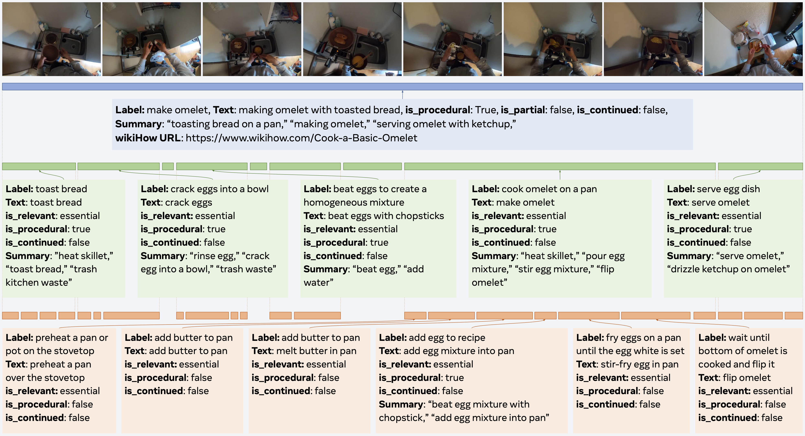

<div align="center">
  
</div>

# Ego4D Goal-Step
Ego4D Goal-Step: Toward Hierarchical Understanding of Procedural Activities (NeurIPS 2023)  
[Yale Song](http://people.csail.mit.edu/yalesong/), [Eugene Byrne](https://www.gene.nyc/), [Tushar Nagarajan](https://tushar-n.github.io/), [Huiyu Wang](https://csrhddlam.github.io/), [Miguel Martin](https://github.com/miguelmartin75), [Lorenzo Torresani](https://ltorresa.github.io/)  
[[OpenReview](https://openreview.net/forum?id=3BxYAaovKr)] [[Data visualization](https://visualize.ego4d-data.org/?q=%22benchmarks+include+goalstep%22)] [[EvalAI test server for step grounding](https://eval.ai/web/challenges/challenge-page/2188/overview)]


## Download
You can get the data directly from this repository, or get them via Ego4D CLI

```
# download goalstep videos & annotations
ego4d --datasets full_scale annotations --benchmark goalstep -o <out-dir>
# download goalstep annotations
ego4d --datasets annotations --benchmark goalstep -o <out-dir>
# download goalstep videos
ego4d --datasets full_scale --benchmark goalstep -o <out-dir>
```

## Visualization
We provide visualization of goal-step annotations via [Ego4D Visualizer](https://visualize.ego4d-data.org/?q=%22benchmarks+include+goalstep%22). Simply select `goalstep` under Annotations and you'll see a timeline view of goals, steps, and substeps with a time marker synchronized with the video player.


## Annotation Format
Goal-step provides hierarchical annotations of procedural human activities in three distinct levels: goals -- steps -- substeps. These annotations are organized in a nested manner shown below:

```json
{
  "video_uid": "9b58e3ab-7b6d-4e79-9eea-c21420b0eedc",
  "start_time": 0.0210286458333333,
  "end_time": 510.1876953125,
  "goal_category": "COOKING:MAKE_OMELET",
  "goal_description": "Make omelette",
  "goal_wikihow_url": "https://www.wikihow.com/Cook-a-Basic-Omelette",
  "summary": [
    "Toasting bread on a pan",
    "Making omelet",
    "Serving omelet with ketchup"
  ],      
  "is_procedural": true,
  "segments": [
    {     
      "start_time": 0,
      "end_time": 56.99209,
      "step_category": "General cooking activity: Toast bread",
      "step_description": "Toast bread",
      "is_continued": false,
      "is_procedural": true,
      "is_relevant": "essential",
      "summary": [
        "heat skillet",
        "toast bread",
        "trash kitchen waste"
      ],  
      "segments": [
        {
          "start_time": 0,
          "end_time": 13.135,
          "step_category": "Cook on a stovetop: Turn on the stovetop",
          "step_description": "preheat the stove-top",
          "is_continued": false,
          "is_procedural": true,
          "is_relevant": "essential",
          "summary": [
            "turn on stove",
            "preheat the stove-top"
          ]
        },
        ...
      ]
    },
    ...
  ]
}
```

* **video_uid**: unique video ID
* **start_time**: A timestamp where a goal segment starts (in seconds)
* **end_time**: A timestamp where a goal segment ends (in seconds)
* **goal_category**: Goal category name
* **goal_description**: Natural language description of the goal
* **goal_wikihow_url**: A wikiHow URL that best captures the steps captured in the video
* **summary**: A list of natural language descriptions summarizing steps captured in the video
* **is_procedural**: Binary flag indicating whether the current segment contains procedural steps
* **segments**: A list of step segments
  - **start_time**: A timestamp where a step segment starts (in seconds)
  - **end_time**: A timestamp where a step segment ends (in seconds)
  - **step_category**: Step category name (shares the same taxonomy with substep categegories)
  - **step_description**: Natural language description of the step
  - **is_continued**: Binary flag indicating whether the current segment contains a step that is continued from an earlier segment
  - **is_procedural**: Binary flag indicating whether the current segment contains procedural steps
  - **is_relevant**: A flag indicating whether the current segment is essential, optional, or irrelevant to the (parent) goal segment
  - **summary**: A list of natural language descriptions summarizing substeps captured in the video
  - **segments**: A list of substep segments
    - ...
   

## Baseline starter code
We provide instructions to run the baselines in the paper to reproduce main results from Table 2. Specifically, in [step_grounding/README.md](step_grounding/README.md) we provide instructions to set up the VSLNet baseline for the step grounding task using the Narrations-as-Queries (NaQ) [codebase](https://github.com/srama2512/NaQ). 
<!-- Goal/Step localization and Online Goal/Step detection starter code coming soon. -->


## License
Ego4D Goal-Step is licensed under the [MIT License](https://github.com/facebookresearch/ego4d-goalstep/blob/main/LICENSE).
